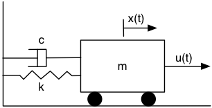
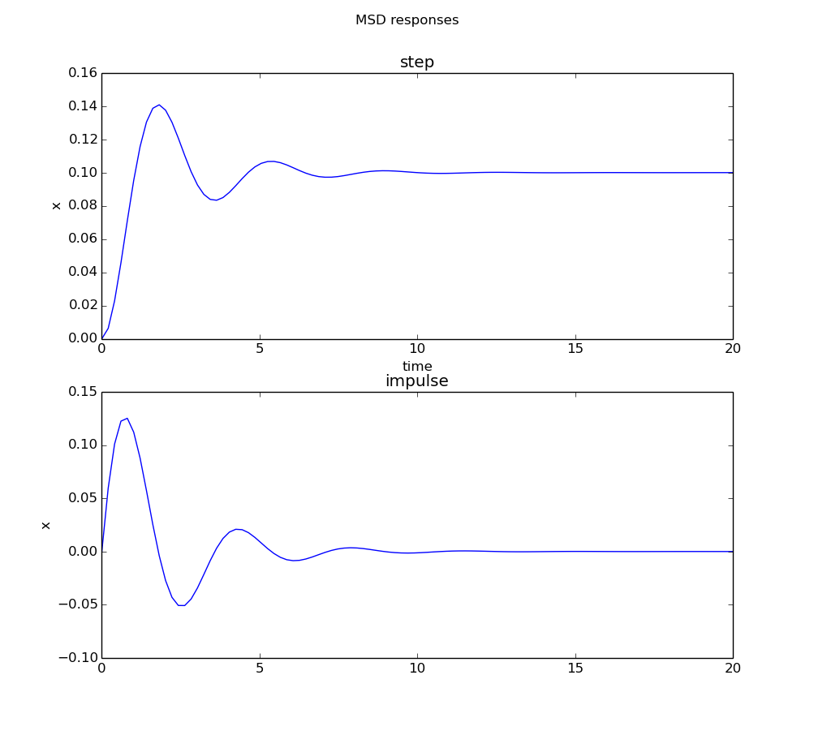

# mass spring damper

[following this example](http://www.roboticslab.ca/mass-spring-damper/)

[derivation of equation that describes motion](http://en.wikipedia.org/wiki/Damping)

(x.. is second derivative of x)

mx.. + cx. + kx = u

* x : position of mass [m] at time t [s]
* m : mass [kg]
* c  : viscous damping coefficient [N s / m]
* k  : spring constant [N / m]
* u : force input [N]

rename first dependent variable x:

x1(t) = x(t)
x2(t) = x.(t) = x1.(t)

x1.(t) = x2(t)
x2.(t) = x..(t)

mx2. + cx2 + kx1 = u

x2. = - c/mx2 + - k/mx1 + u/m

in matrix form:

    | x1. | = | 0        1 |  | x1 |  + | 0   | u
    | x2. |   | -k/m  -c/m |  | x2 |    | 1/m |
                    A                      B

output equation (want to know position of mass)

y = x(t) = x1(t)
 
    y = | 1 0 | | x1 |  + 0 u
                | x2 |
           C              D

Then using a [python control library](http://python-control.sourceforge.net/manual/timeresp.html?highlight=step)

The step and impulse response was plotted for 

* k = 10.0
* m = 3.0
* c = 3.0

[Source code](plot.py)
